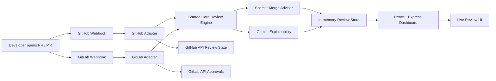

# ReviewAI

The canonical documentation has moved to [README.md](README.md).
## Project Overview

CodeSentinel helps teams review pull requests faster by surfacing issues, explaining why they matter, and recommending whether a change is ready to merge.



## Problem Statement

Pull request review is slow because engineers spend time re-reading diffs, sorting signal from noise, and deciding whether a change is safe to merge.

CodeSentinel reduces that overhead by automatically:

- scoring the review result,
- explaining findings in plain English,
- recommending a merge verdict,
- and posting review state back to the hosting platform.

**Impact:** CodeSentinel saves roughly **1 hour per PR** in review triage and follow-up for small teams and fast-moving hackathon demos.

## Key Features

- Live review feed with scores, trends, and issue cards
- Issue explainability with streaming AI responses
- Merge readiness verdicts with blockers and quick wins
- GitHub and GitLab webhook automation
- Automatic review state updates back to the platform
- Local demo seeding for presentation mode
- Powered by Google Gemini 2.5 Flash (free tier)

## Tech Stack

| Layer | Technology | Purpose |
| --- | --- | --- |
| Runtime | Node.js | Server execution and local development |
| Language | TypeScript | Type-safe monorepo code |
| Backend | Express | Webhooks, APIs, dashboard server |
| Frontend | React | Interactive dashboard UI |
| AI | Gemini 2.5 Flash | Review generation, explanations, summaries |
| GitHub Integration | GitHub API | Review comments and review state updates |
| GitLab Integration | GitLab API | Discussions, notes, and merge request approvals |

## Quick Start

### 1. Get a free Gemini API key

Visit [aistudio.google.com](https://aistudio.google.com) and create a free Gemini API key. No credit card is required for the free tier.

### 2. Set up `.env`

Create a `.env` file in the repository root. You can copy the included example instead of creating it by hand:

```bash
cp .env.example .env  # macOS / Linux
copy .env.example .env # Windows (PowerShell/CMD)
```

See [`.env.example`](.env.example) for the full list of variables and placeholders.

### 3. Install dependencies

```bash
corepack pnpm install
```

### 4. Start the dashboard

```bash
corepack pnpm dev
```

The dashboard runs at `http://127.0.0.1:3000/`.

### 5. Expose the server with ngrok

In a second terminal:

```bash
ngrok http 3000
```

Copy the HTTPS forwarding URL and use it for webhook configuration.

### 6. Run the demo setup

```bash
bash scripts/demo-setup.sh
```

That script checks your environment variables, starts the dashboard, starts ngrok, seeds five demo reviews, prints webhook URLs, and opens the browser.

## Deployment

This repository includes a Dockerfile so the app can run on any container host that supports a long-lived Node.js service.

```bash
docker build -t reviewai .
docker run --env-file .env -p 3000:3000 reviewai
```

Set the same environment variables in your host platform and expose port `3000`. The service entrypoint is `packages/dashboard/dist/server.js` after `pnpm build` completes.

If you prefer a managed platform such as Render, Railway, Fly.io, or a VPS, use the Dockerfile or run:

```bash
corepack pnpm install --frozen-lockfile
corepack pnpm build
corepack pnpm start
```

For Render specifically, this repo includes a [render.yaml](render.yaml) blueprint. Create a new Render Web Service from the repository and let Render read the blueprint, then set the listed environment variables in the Render dashboard.

The Render blueprint also enables `DEMO_SEED=true`, so the live dashboard boots with seeded demo reviews.

## Registering Webhooks

### GitHub App

1. Create a GitHub App in your account or organization settings.
2. Set the webhook URL to your ngrok HTTPS URL plus `/webhooks/github`.
3. Subscribe to `pull_request` events.
4. Generate the webhook secret and save it in `GITHUB_APP_SECRET`.
5. Provide a token with permission to write pull request reviews.
6. Install the app on the repository you want to demo.

Screenshot placeholder:


### GitLab Webhook

1. Open your GitLab project or group settings.
2. Add a webhook pointing to your ngrok HTTPS URL plus `/webhooks/gitlab`.
3. Enable merge request events.
4. Set the secret token and save it in `GITLAB_WEBHOOK_SECRET`.
5. Provide `GITLAB_API_TOKEN` so CodeSentinel can post notes and approvals.

Screenshot placeholder:


## API Documentation

| Method | Endpoint | Description |
| --- | --- | --- |
| `GET` | `/health` | Service health check |
| `GET` | `/api/reviews` | List recent reviews from the in-memory store |
| `GET` | `/api/reviews/:prId` | Fetch one stored review by PR or MR id |
| `GET` | `/api/reviews/:prId/explain/:issueIndex` | Stream a Gemini explanation for one issue via SSE |
| `GET` | `/api/stats` | Dashboard summary statistics |
| `POST` | `/api/review` | Analyze a review payload directly |
| `POST` | `/api/demo/seed` | Seed five fake reviews for the demo dashboard |
| `POST` | `/webhooks/github` | GitHub webhook ingestion endpoint |
| `POST` | `/webhooks/gitlab` | GitLab webhook ingestion endpoint |

## Example Review Output

Example response from `GET /api/reviews/demo-101` after seeding the demo store:

```json
{
	"key": "github:acme/codesentinel:demo-101",
	"createdAt": "2026-05-23T12:00:00.000Z",
	"event": {
		"id": "demo-101",
		"title": "Harden auth token handling",
		"description": "Replace hard-coded token paths and tighten validation.",
		"author": "demo-bot",
		"sourceBranch": "demo/auth-hardening",
		"targetBranch": "main",
		"platform": "github",
		"diffUrl": "https://example.com/demo-101.diff",
		"repoFullName": "acme/codesentinel"
	},
	"result": {
		"prId": "demo-101",
		"summary": "Improves secret handling and reduces the risk of leaking credentials in logs.",
		"issues": [
			{
				"severity": "critical",
				"category": "security",
				"line": 12,
				"message": "Credentials are still read from an environment path that can be logged or copied too easily.",
				"suggestion": "Move the value behind a secret manager wrapper and avoid echoing it in debug output.",
				"filename": "src/auth.ts"
			}
		],
		"score": 42,
		"processingMs": 1280
	},
	"mergeRecommendation": {
		"verdict": "block",
		"confidence": 92,
		"blockers": [
			"src/auth.ts:12 - Credentials are still read from an environment path that can be logged or copied too easily."
		],
		"quickWins": [],
		"riskAreas": [
			"security in src/auth.ts"
		]
	}
}
```

## Rate Limit Note

Gemini free tier allows **10 RPM / 250 RPD** - sufficient for demo and small teams.

## Repository Layout

- `packages/shared` - shared types and utilities
- `packages/core` - review engine, scoring, explainability, merge advice
- `packages/github-adapter` - GitHub webhook handling and review publishing
- `packages/gitlab-adapter` - GitLab webhook handling and merge request publishing
- `packages/dashboard` - Express dashboard server and React UI

## Development Notes

- The workspace uses ESM and NodeNext TypeScript settings.
- The dashboard keeps review data in memory for fast demo iteration.
- Explainability uses SSE so the UI can show a live typewriter effect.
- Merge readiness is computed once in core and reused by adapters and the dashboard.

## Why It Wins Demos

CodeSentinel is easy to explain in one sentence: it reviews code, explains the risk, and tells you whether the PR is ready to merge.

That makes it ideal for hackathons because the demo is immediate, visual, and credible.